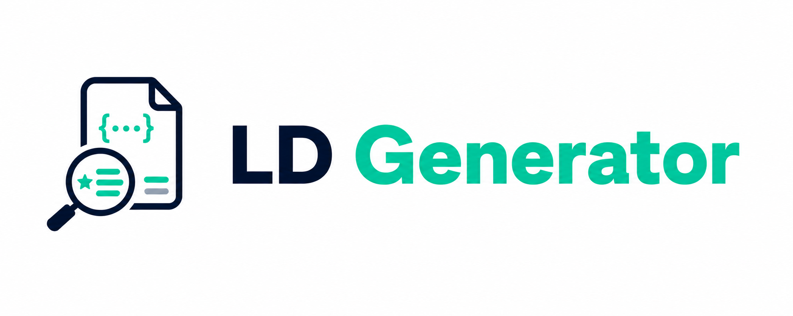

<p align="center">
  
</p>

[](https://www.npmjs.com/package/ld-generator)
[](./LICENSE.md)
[](https://www.typescriptlang.org/)
[](./package.json)

# ld-generator

Typed Schema.org JSON-LD builders for TypeScript projects. The library returns plain JavaScript objects that are ready to serialize with `JSON.stringify(...)` and embed into HTML.

## Features

- Zero runtime dependencies
- Typed factory functions for common Schema.org entities
- Small modular API with one schema per file
- ESM build output with declaration files
- Works well with React, Next.js, and server-rendered HTML

## Installation

```bash
npm install ld-generator
```

## Quick Start

```tsx
import {offer, product} from 'ld-generator';

const productData = product({
  name: 'Sample Product',
  description: 'A compact example product.',
  image: 'https://example.com/image.jpg',
  brand: 'Brand Name',
  offers: offer({
    price: 29.99,
    priceCurrency: 'USD',
    availability: 'InStock',
  }),
});

export function ProductSchema() {
  return (
    <script
      type="application/ld+json"
      dangerouslySetInnerHTML={{__html: JSON.stringify(productData)}}
    />
  );
}
```

Grouped convenience API is also available:

```ts
import {schema} from 'ld-generator';

const productData = schema.product({
  name: 'Sample Product',
  description: 'A compact example product.',
  image: 'https://example.com/image.jpg',
  brand: 'Brand Name',
  offers: schema.offer({
    price: 29.99,
    priceCurrency: 'USD',
  }),
});
```

When bundle size matters, prefer direct named imports like `product` and `offer`.

## Documentation

- [Documentation index](./docs/README.md)
- [API reference](./docs/api.md)
- [Development guide](./docs/development.md)
- [Project context](./CONTEXT.md)

## Contributing

Contributions are welcome. Start with [CONTRIBUTING.md](./CONTRIBUTING.md) and the [development guide](./docs/development.md).

## License

[MIT](./LICENSE.md)
